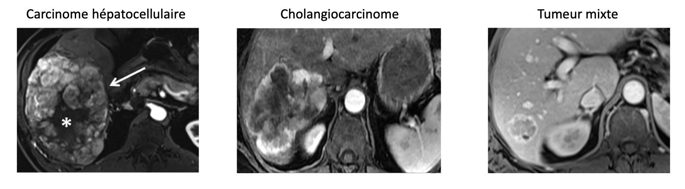

# Liver Cancer Subtype Detection using Radiomic Data Analysis

## Project Overview


*Visualization of the three carcinoma subtypes (CCK, CHC, Mixed Tumors)*

This repository hosts the code and documentation for a study on liver cancer subtype detection using advanced multivariate data analysis techniques. The project aims to differentiate between three primary liver cancer subtypes—Hepatocellular Carcinoma (CCK), Cholangiocarcinoma (CHC), and Mixed Tumors (Mixtes)—by analyzing radiomic features from contrast-enhanced imaging data. The study employs various analytical methods, including Principal Component Analysis (PCA), Regularized Generalized Canonical Correlation Analysis (RGCCA), Sparse RGCCA (SGCCA), and PARAFAC (Parallel Factor Analysis) on tensor data, to handle high-dimensional datasets and enhance diagnostic accuracy. This research underlines the importance of advanced image analysis and multivariate techniques in the early diagnosis and subtype differentiation of liver cancer. The findings indicate that reduction technique and multiway analysis can potentially influence personalized treatment strategies.

For a detailed exploration of our methodologies, results, and discussions, refer to our comprehensive report: [Full Project Report](report/Final_Report.pdf)


## Dataset

The dataset includes 147 hepatic tumor instances with multiple observations across different contrast phases (ART, PORT, VEIN, TARD). It encompasses a broad spectrum of radiomic features: first-order statistics, shape, and texture descriptors. We have both the global radiomic data - where each patient ID is duplicated across the four injection phases - and the multislice radiomic data - where each patient ID is duplicated across a varying number slices (ranging from 1 to 90) and across injection phases.

## Usage

Please download all the requirements running:

```bash
pip install -r requirements.txt
```

Please refer to the notebooks/ directory that contains all the analyses performed during the project. The RGCCA analysis was conducted in the R Markdown file RGCCA.md in notebooks/. Source code for data preprocessing and analysis is located within the src/ directory, as the data can be found in data/.


## References

- [Tenenhaus A, Philippe C, Guillemot V, Le Cao KA, Grill J, Frouin V. Variable selection for generalized canonical correlation analysis.](https://arxiv.org/pdf/1611.07308.pdf)
- [Sort L, Girka F, Le Brusquet L, Tenenhaus A. Décomposition PARAFAC pour données longitudinales.](https://graph-neural-networks.github.io/static/file/chapter10.pdf)